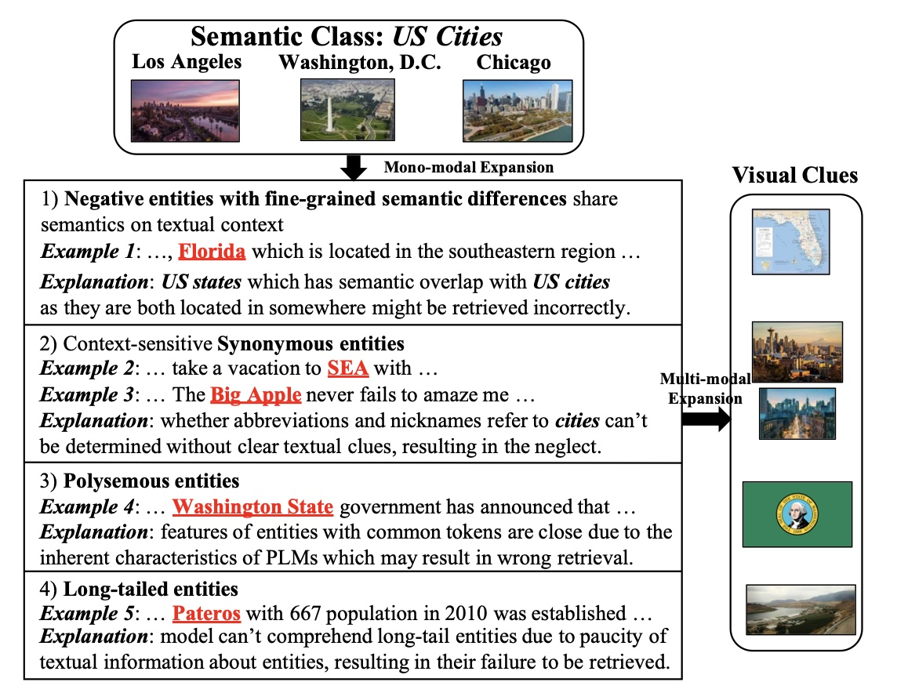
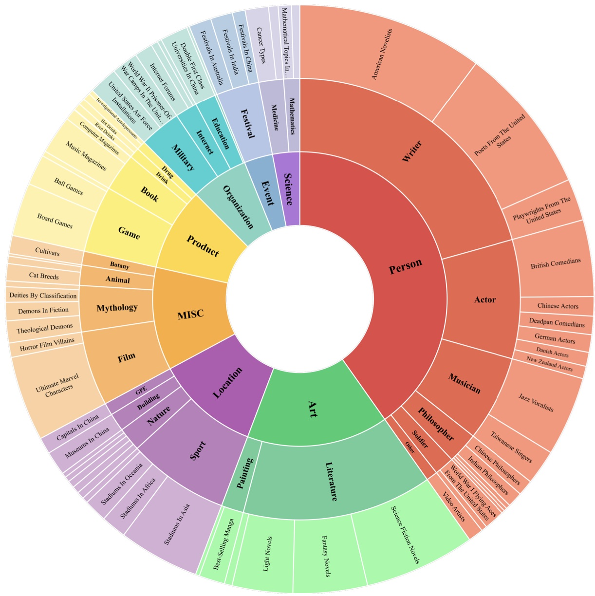

# 🏝️ MESED: A Multi-modal Entity Set Expansion Dataset with Fine-grained Semantic Classes and Hard Negative Entities

[](https://pytorch.org/)[](https://arxiv.org/abs/2307.16210)

>The Entity Set Expansion (ESE) task aims to expand a handful of seed entities with new entities belonging to the same semantic class. Conventional ESE methods are based on mono-modality (i.e., literal modality), which struggle to deal with complex entities in the real world such as (1) Negative entities with fine-grained semantic differences. (2) Synonymous entities. (3) Polysemous entities. (4) Long-tailed entities. These challenges prompt us to propose novel Multi-modal Entity Set Expansion (MESE), where models integrate information from multiple modalities to represent entities. Intuitively, the benefits of multi-modal information for ESE are threefold: (1) Different modalities can provide complementary information. (2) Multi-modal information provides a unified signal via common visual properties for the same semantic class or entity. (3) Multi-modal information offers robust alignment signals for synonymous entities. To assess model performance in MESE, we constructed the MESED dataset which is the first multi-modal dataset for ESE with large-scale and elaborate manual calibration. A powerful multi-modal model MultiExpan is proposed which is pre-trained on four multimodal pre-training tasks. The extensive experiments and analyses on MESED demonstrate the high quality of the dataset and the effectiveness of our MultiExpan, as well as pointing the direction for future research.



You can refer to [the arXiv version with Appendix](https://arxiv.org/abs/2307.14878).

## 🔬 Dependencies

```bash
pip install -r requirement.txt
```

#### Details

- python==3.9
- pytorch==2.0.1
- transformers==4.28.0
- torchvision
- scipy

## 📚 Dataset(MESED)

- Run


```
wget -O dataset0 https://cloud.tsinghua.edu.cn/f/5f1c716620bf4c4ca7cb/?dl=1
wget -O dataset1 https://cloud.tsinghua.edu.cn/f/035ee15f2dea4e4285ed/?dl=1
cat dataset* > dataset.tar.gz

wget -O data.tar.gz https://cloud.tsinghua.edu.cn/f/4538ef423b0d43df8b88/?dl=1
```

to get datasets used in our experiments.

- Unzip it to make those data and code files **satisfy the following file hierarchy**

```
MESED
├── dataset
│   ├── image
│   └── mention
├── MultiExpan
│   ├── data
│   │   ├── gt
│   │   ├── query
│   │   ├── query_seed=5
│   │   ├── eid2cls.pkl
│   │   ├── entity2id.txt
│   │   └── sentences.json
│   └── src
│       ├── Expan.py
│       ├── HCL.py
│       ├── main.py
│       ├── make_cls2eids.py
│       ├── make_entity2sents.py
│       ├── Trans.py
│       └── utils.py
├── README.md
└── requirement.txt
```


>MESED is the first multi-modal ESE dataset with meticulous manual calibration. It consists of three layers, with 14,489 entities collected from Wikipedia, and 434,675 image-sentence pairs. The first and second layers encompass 8 and 26 coarse-grained semantic classes, respectively, and the last layer contains 70 fine-grained semantic classes. The 70 fine-grained semantic classes in MESED contain an average of 82 entities with a minimum of 23 and a maximum of 362. Each fine-grained class contains 5 queries with three seed entities and 5 queries with five seed entities.



## 🚀 Train and Evaluate

Run

```
python make_entity2sents.py
```

to get the folder "MESED/MultiExpan/data/entity2sents" that contains the preprocessed data.

To train a model with Masked Entity Prediction task, run

```
python main.py -mode 0 -save_path <model_path>
```

After pretraining,  run

```
python main.py -mode 0 -pretrained_model <model_path> -output <output_path> -result <result_file>
```

to get expansion results with the single MEP loss.

Then run

```
python make_cls2eids.py -path_expand_result <best_epoch>
```

to get hard negative entities, which saved in "MESED/MultiExpan/data/cls2eids.pkl".

Finally, training full model with four loss and getting final expansion results, please run

```
python main.py -mode 4 -save_path <model_path>
python main.py -mode 4 -pretrained_model <model_path> -output <output_path> -result <result_file>
```

## 🤝 Cite:
Please condiser citing this paper if you use the ```code``` or ```data``` from our work.
Thanks a lot :)

```
@article{li2023mesed,
  title={MESED: A Multi-modal Entity Set Expansion Dataset with Fine-grained Semantic Classes and Hard Negative Entities},
  author={Li, Yangning and Lu, Tingwei and Li, Yinghui and Yu, Tianyu and Huang, Shulin and Zheng, Hai-Tao and Zhang, Rui and Yuan, Jun},
  journal={arXiv preprint arXiv:2307.14878},
  year={2023}
}
```

## 💡 Acknowledgement

- We appreciate  [```CGExpan```](https://github.com/yzhan238/CGExpan), [```ProbExpan```](https://github.com/geekjuruo/ProbExpan) and many other related works for their open-source contributions.

